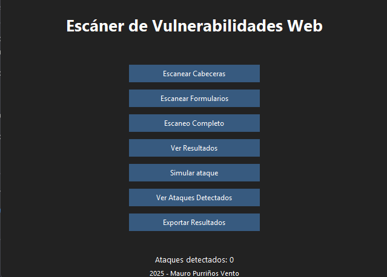
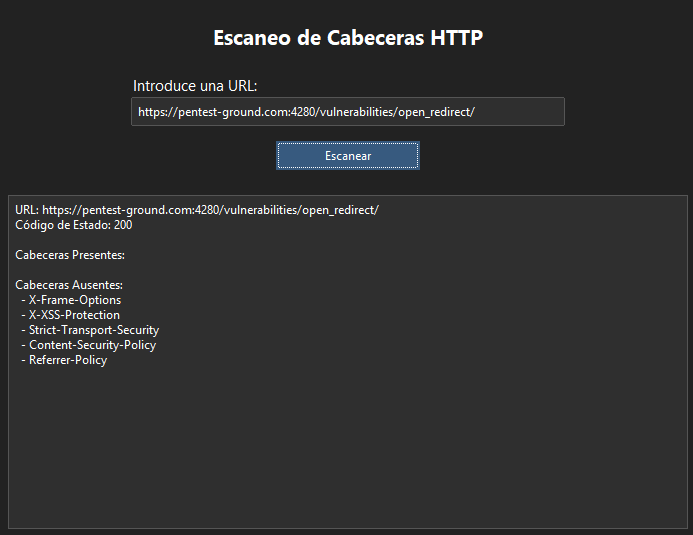
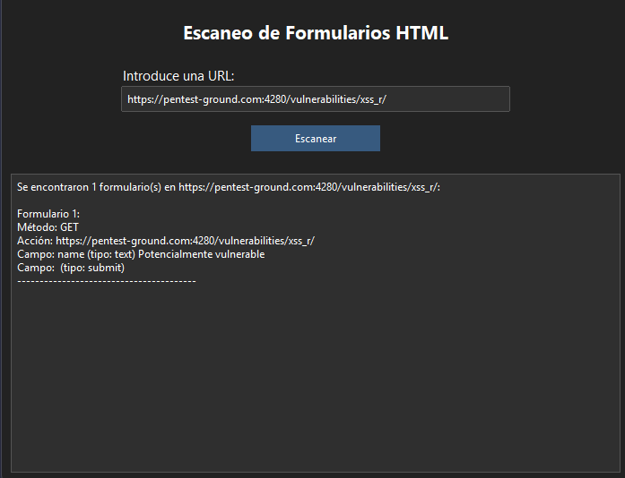
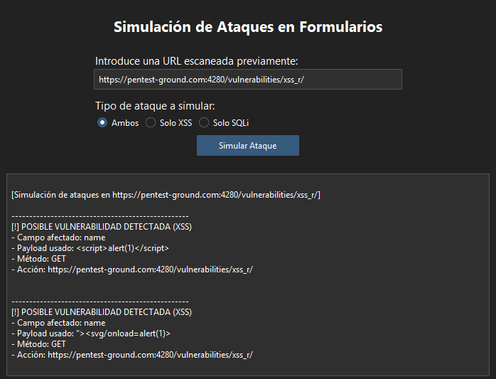

# Escáner de Vulnerabilidades Web

Aplicación de escritorio en Python para reconocimiento y pruebas básicas de seguridad sobre aplicaciones web: análisis de cabeceras HTTP, enumeración de formularios y simulación de payloads XSS / SQLi sobre los campos detectados.

El objetivo del proyecto es automatizar la fase de reconocimiento inicial en una auditoría web (las comprobaciones que cualquier pentester haría a mano al empezar) y dejar evidencia estructurada y exportable de lo encontrado.

---

> ⚠️ **Uso responsable:** esta herramienta envía payloads activos (XSS, SQLi) a los formularios que encuentra. Únicamente debe usarse contra objetivos para los que tengas autorización explícita (entornos propios, laboratorios como DVWA, testphp.vulnweb.com o programas de bug bounty con alcance autorizado). Lanzar estos payloads contra sistemas de terceros sin permiso es ilegal en España (Art. 197 bis y ss. del Código Penal).



---

## Funcionalidades

| Función | Qué hace | Categoría OWASP relacionada |
|---|---|---|
| Escaneo de cabeceras HTTP | Detecta ausencia de cabeceras de seguridad (`Content-Security-Policy`, `X-Frame-Options`, `Strict-Transport-Security`, etc.) | A05:2021 – Security Misconfiguration |
| Enumeración de formularios | Localiza formularios HTML y clasifica campos por riesgo (`text`, `email`, `password`…) | Reconocimiento / Mapeo de superficie de ataque |
| Simulación de XSS | Envía payloads reflejados y comprueba si vuelven sin sanitizar en la respuesta | A03:2021 – Injection (XSS) |
| Simulación de SQLi | Envía payloads de inyección SQL y busca patrones de error de BD en la respuesta | A03:2021 – Injection (SQLi) |
| Registro de evidencia | Guarda método, acción, campo, payload y evidencia de cada hallazgo en SQLite | Trazabilidad para informe |
| Historial y exportación | Consulta resultados anteriores por URL; exporta a JSON/CSV | Reporting |



---

## Cómo funciona (resumen técnico)

- **Cabeceras** (`escanear_cabeceras`): petición GET a la URL, compara las cabeceras presentes en la respuesta contra una lista de referencia almacenada en SQLite.
- **Formularios** (`escanear_formularios`): parsea el HTML con BeautifulSoup, localiza todos los `<form>` y sus campos (`<input>`, `<textarea>`), y marca como "potencialmente vulnerables" los de tipo `text`, `search`, `email` o `password` (los que normalmente aceptan input libre del usuario).
- **Simulación de ataques** (`simular_ataques`): para cada formulario marcado como potencialmente vulnerable, envía cada payload de la base de datos (XSS o SQLi, según se elija) y comprueba dos señales:
  - si el payload aparece reflejado literalmente en la respuesta (indicio de XSS sin sanitizar)
  - si la respuesta contiene patrones de error de bases de datos conocidos (indicio de SQLi)

 

---

## Limitaciones conocidas

Para que quede claro qué hace y qué no hace esta herramienta — no quiero venderla como algo que no es:

- **Detección por reflejo simple:** si un payload aparece en el HTML de respuesta, se marca como posible vulnerabilidad. Esto genera falsos positivos en páginas que hacen echo del input sin que exista una vulnerabilidad real (p. ej. si el campo se sanitiza pero se muestra igualmente de forma segura). No sustituye una validación manual ni un proxy de intercepción (Burp Suite).
- **No prueba SQLi por tiempo ni booleano avanzado** — solo detección por patrón de error visible en la respuesta (error-based), no blind SQLi.
- **No gestiona JavaScript dinámico:** si los formularios se generan o se envían vía JS (SPA, fetch/AJAX), BeautifulSoup no los detecta porque no ejecuta JS.
- **No mantiene sesión/autenticación:** no contempla login previo, por lo que no analiza páginas que requieran sesión iniciada.

---

## Tecnologías

- Python 3
- **Tkinter + ttkbootstrap** — interfaz gráfica de escritorio
- **SQLite3** — almacenamiento local de resultados, payloads y configuración
- **requests** — peticiones HTTP
- **BeautifulSoup4 + lxml** — parseo de HTML

---

## Estructura del proyecto

```
escanerVulnerabilidades/
├── main_gui.py              # Interfaz gráfica principal (ttkbootstrap)
├── db/
│   └── init_db.py           # Creación de tablas y carga inicial de payloads/cabeceras de referencia
├── utils/
│   ├── scanner.py           # Lógica de escaneo: cabeceras, formularios, simulación de ataques
│   └── db.py                # Acceso a datos: guardado, consulta y exportación (JSON/CSV)
├── requirements.txt
└── README.md
```

---

## Instalación y uso

```bash
git clone https://github.com/Shiro1591/escanerVulnerabilidades.git
cd escanerVulnerabilidades
pip install -r requirements.txt
python main_gui.py
```

La base de datos (`db/scanner.db`) se crea automáticamente la primera vez que se ejecuta, con los payloads y cabeceras de referencia precargados.
